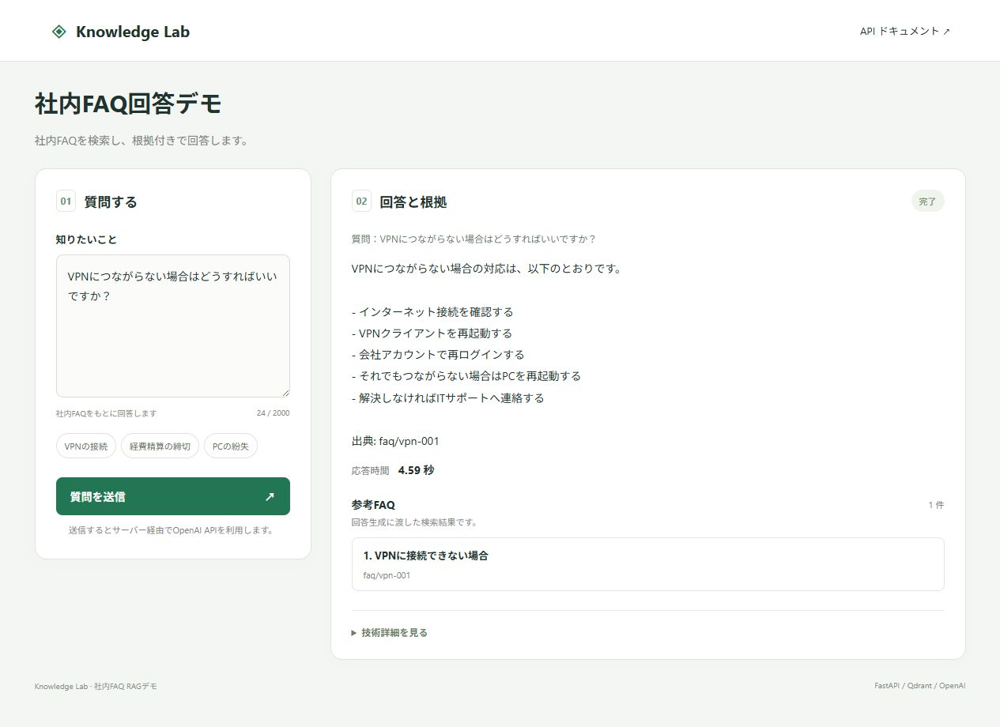

# Knowledge Lab — FastAPI・Qdrant・OpenAIで作る社内FAQ RAG

社内FAQ・業務マニュアル検索を想定した、小型のRAG（Retrieval-Augmented Generation）APIです。

質問を入力すると、Qdrantで関連FAQを検索し、OpenAIが取得した情報から回答を生成します。回答・参考FAQ・応答時間を確認できる、ローカル実行用のPoCです。

**確認できる実装**：Python / FastAPI、OpenAI API連携、Qdrantの登録・検索、根拠候補の提示、処理時間計測、Hit@3評価、Docker Compose、pytest。

**画面の設計**：質問と回答を中心に表示し、Top-K・検索スコア・時間の内訳・JSONは「技術詳細を見る」にまとめています。利用体験と技術検証の両方を確認できます。

## 画面



画面は2026年9月6日にOpenAI・Qdrantへ実接続して取得したものです（サンプルFAQ、Top-K 1）。応答時間はこの1回の実行値であり、平均性能や改善効果を示すベンチマークではありません。

## 1. 環境設定

Docker Desktop（またはDocker Engine + Compose）と、利用可能なOpenAI APIキーが必要です。FAQ登録と質問送信でAPI利用料が発生します。

初回のみ `.env.example` をコピーします。既存の `.env` は上書きしないでください。

```bash
cp .env.example .env
```

`.env` にOpenAI APIキーを設定します。

```env
OPENAI_API_KEY=sk-xxxxxxxxxxxxxxxx
```

利用可能なOpenAIモデルに合わせて `OPENAI_MODEL` を変更できます。

## 2. 起動

リポジトリのルートディレクトリで、Docker Composeを使ってAPIとQdrantを起動します。

| サービス | コンテナ名 | 公開ポート |
| --- | --- | --- |
| 質問画面・API | `rag-api` | `8000` |
| Qdrant | `rag-qdrant` | `6333`（HTTP）、`6334`（gRPC） |

起動前に、上記のポートとコンテナ名が他のサービスで使用されていないことを確認してください。

Qdrantのデータは、Composeが管理する名前付きボリューム `qdrant_data` に保存します。初回起動後に、次の「FAQデータの登録」の手順でサンプルFAQを登録します。

```bash
docker compose up -d qdrant
docker compose build api
docker compose up -d api
```

Qdrant Dashboard:

```text
http://localhost:6333/dashboard
```

FastAPI Swagger UI:

```text
http://localhost:8000/docs
```

## 3. FAQデータの登録

```bash
docker compose run --rm api python -m scripts.index_documents
```

成功例:

```text
Indexed 7 documents into Qdrant.
```

## 4. ブラウザーで質問する

FAQ登録後、[質問画面](http://localhost:8000/)を開きます。

1. 「VPNの接続」などの質問例を選ぶか、質問を入力します。
2. 「質問を送信」を押し、回答・参考FAQ・応答時間を確認します。
3. 「技術詳細を見る」を開くと、検索スコアと検索・生成時間の内訳を確認できます。
4. 同じ詳細内でTop-K（1〜10）を変更し、質問を再送すると、根拠と時間の変化を観察できます。
5. 「リクエスト / レスポンス JSON」で実際の入出力を確認できます。

画面はFastAPIから配信するHTML/CSS/JavaScriptです。Node.jsのビルドや別フロントエンドサーバーは不要です。APIキーはサーバーの環境変数だけに設定します。

類似度は回答の正確性を表す値ではありません。表示される文書は検索で取得した候補であり、回答中の各主張との対応付けは未実装です。合計時間はサーバー内の処理時間で、ブラウザーとの通信時間を含みません。

実行中は二重送信を防止し、通信・APIエラーを表示します。120秒でブラウザーの応答待ちを中断しますが、サーバー側の処理停止を保証するものではありません。

### APIから質問する

```bash
curl -X POST "http://localhost:8000/ask" \
  -H "Content-Type: application/json" \
  -d '{"question":"VPNにつながらない場合はどうすればいいですか？","top_k":3}'
```

レスポンス例:

```json
{
  "answer": "まずインターネット接続を確認し...",
  "sources": [
    {
      "source": "faq/vpn-001",
      "title": "VPNに接続できない場合",
      "score": 0.82
    }
  ],
  "retrieval_ms": 210.34,
  "generation_ms": 980.21,
  "total_ms": 1190.55
}
```

## 5. 評価

```bash
docker compose run --rm api python -m eval.evaluate
```

評価では、期待したFAQがTop-3検索結果に含まれた割合を `Retrieval Hit@3` として計測します。

例:

```text
Retrieval Hit@3: 100.0%
Average total latency: 1050.23 ms
```

## 6. テスト

```bash
docker compose run --rm api python -m pytest -q
```

## システム構成

```text
Client
  |
  | POST /ask
  v
FastAPI
  |
  +--> OpenAI Embeddings
  |        |
  |        v
  +----> Qdrant ----> Top-K documents
  |                     |
  |                     v
  +--------------> OpenAI Responses API
                         |
                         v
              Answer + Sources + Latency
```

### ローカル単体テスト（外部サービス不要）

```bash
python -m venv .venv
# Windows PowerShell: .\.venv\Scripts\Activate.ps1
# macOS/Linux: source .venv/bin/activate
python -m pip install -r requirements.txt
python -m pytest -q
```

UI配信とAPIの結合テストではRAGサービスをモック化し、有料APIとQdrantを呼びません。実際の検索・生成はDocker起動後の別途確認が必要です。


## 終了と再起動

終了する場合は、リポジトリのルートディレクトリで実行します。

```bash
docker compose down
```

名前付きボリュームは保持されるため、再起動後も登録済みのFAQを利用できます。`docker compose down -v` は保存データも削除するため、データを残したい場合は使用しません。

再起動には「2. 起動」のコマンドを使用します。データを変更していなければ、FAQの再登録は不要です。
